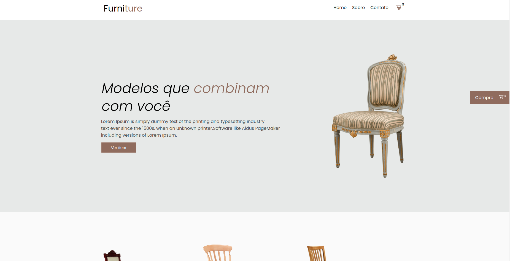

<h1 align="center">E-commerce page</h1>

<h5 align="center">This is simple personal project using Reactjs</h5>

<h6 align="center"> A demo can be found here: </h6>

    <a href="#">
        Demo
    </a>

---

## Technologies

This project was developed with following technologies:

- [ReactJs](https://reactjs.org/)
- [styled-components](https://styled-components.com/)
- [react-router-dom](https://reactrouter.com/)
- [framer-motion](https://www.framer.com/motion/)
- [react-router-hash-link](https://github.com/rafgraph/react-router-hash-link)
  
---  

## How to run

Clone this repo, and run command:

`yarn install`

or

`npm install`

**You can run the command:**

`yarn start`

or

`npm start`

Open **localhost:3000** to view it in the browser.

---

Made by Rafael Butler
